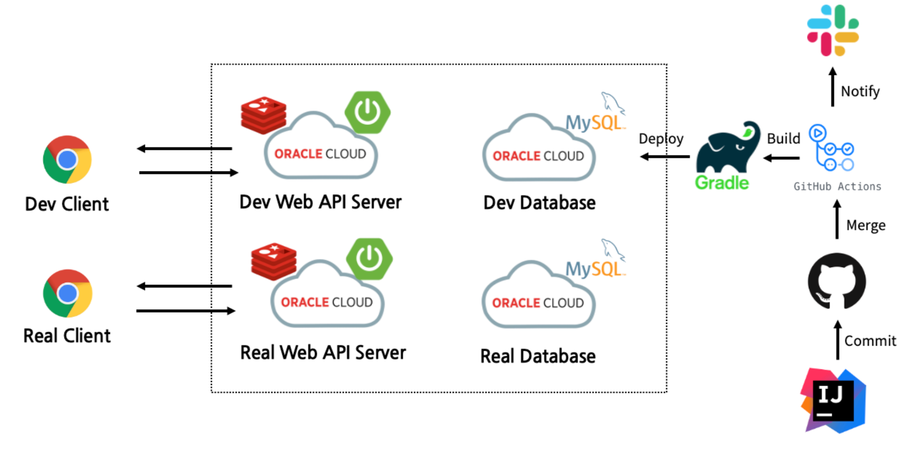

    <h1> Dev Event Server 인프라 💻 </h1>

 

## 0. 아키텍처

 

## 1. 웹 서버

### 1-1. 인스턴스 스팩

<table>
    <thead>
        <tr>
            <th> 항목 </th>
            <th> 정보 </th>
        </tr>
    </thead>
    <tbody>
        <tr>
            <td> Shape name </td>
            <td> VM.Standard.E2.1.Micro </td>
        </tr>
        <tr>
            <td> CPU </td>
            <td> 1 core 2.0 GHz AMD EPYC™ 7551 (Naples) </td>
        </tr>
        <tr>
            <td> RAM </td>
            <td> 1GM </td>
        </tr>
        <tr>
            <td> Network Bandwidth </td>
            <td> 0.48 Gbps </td>
        </tr>
        <tr>
            <td> Volume Size </td>
            <td> 50GB </td>
        </tr>
        <tr>
            <td> OS </td>
            <td> 
                Canonical Ubuntu 20.04  
                2021.12.01-0
            </td>
        </tr>
    </tbody>
</table>

 

### 1-2. 인스턴스 정보

<table>
    <thead>
        <tr>
            <th> 항목 </th>
            <th> URL </th>
            <th> 관리자 </th>
            <th> 생성일 </th>
        </tr>
    </thead>
    <tbody>
        <tr>
            <td> 개발 </td>
            <td> 사용시 문의 </td>
            <td> osj </td>
            <th> 21. 12. - </th>
        </tr>
        <tr>
            <td> 상용 </td>
            <td> 사용시 문의 </td>
            <td> osj </td>
            <th> 21. 12. 23 </th>
        </tr>
    </tbody>
</table>

 

### 1-3. 배포 파이프라인
- Git Action
    - Private 저장소는 1달 2000분 무료
    - 배포 완료까지 1분 30초

 

## 2. DB 인스턴스 

### 2-1. 인스턴스 스팩

<table>
    <thead>
        <tr>
            <th> 항목 </th>
            <th> 정보 </th>
        </tr>
    </thead>
    <tbody>
        <tr>
            <td> Shape name </td>
            <td> VM.Standard.E2.1.Micro </td>
        </tr>
        <tr>
            <td> CPU </td>
            <td> 1 core 2.0 GHz AMD EPYC™ 7551 (Naples) </td>
        </tr>
        <tr>
            <td> RAM </td>
            <td> 1GM </td>
        </tr>
        <tr>
            <td> Network Bandwidth </td>
            <td> 0.48 Gbps </td>
        </tr>
        <tr>
            <td> Volume Size </td>
            <td> 50GB </td>
        </tr>
        <tr>
            <td> OS </td>
            <td> 
                Canonical Ubuntu 20.04  
                2021.12.01-0
            </td>
        </tr>
    </tbody>
</table>

> *볼륨은 기본 100GB내에서 인스턴스 두개까지 무료

 

### 2-2. 인스턴스 정보

<table>
    <thead>
        <tr>
            <th> 항목 </th>
            <th> IP </th>
            <th> 계정명 </th>
            <th> 관리자 </th>
            <th> 생성일 </th>
        </tr>
    </thead>
    <tbody>
        <tr>
            <td> 개발 </td>
            <td> 문의: covenant </td>
            <td> covenant </td>
            <td> covenant </td>
            <td> 21. 12. 16 </td>
        </tr>
        <tr>
            <td> 상용 </td>
            <td> 문의: covenant </td>
            <td> covenant </td>
            <td> covenant </td>
            <td> 21. 12. 17 </td>
        </tr>
    </tbody>
</table>

 

 
 

  

    <h3> 용감한 친구들 with 남송리 삼번지 </h3>
  

